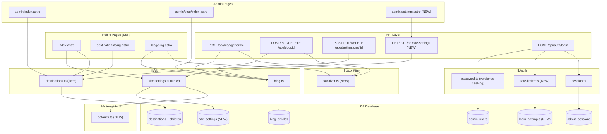

# Design Document — Production Readiness Foundation

## Overview

This document describes the technical design for the Production Readiness Foundation of `infotour.id` — an Indonesian travel directory built on Astro 6 + Cloudflare Pages + D1. The work closes two classes of issues blocking production launch:

1. **P0 Bug Fixes (Requirements 1–9)**: data loss, XSS vulnerability, broken deploy config, missing delete UI, and auth hardening.
2. **Site Settings SSOT (Requirements 10–16)**: a new `site_settings` table and admin UI that replaces all hardcoded branding, contact info, hero copy, analytics tags, and stats across the frontend.

### Scope

| Section | Requirements | New / Modified Files |
|---|---|---|
| Bug Fixes | 1–9 | `src/lib/content/sanitizer.ts` (new), `src/lib/auth/rate-limiter.ts` (new), `src/lib/auth/password.ts` (modified), `src/lib/db/destinations.ts` (modified), `src/pages/api/blog/generate.ts` (modified), `src/components/blog/ArticleContent.astro` (modified) |
| Site Settings Data | 10–11 | `src/lib/db/site-settings.ts` (new), `src/lib/site-settings/defaults.ts` (new), `migrations/0004_site_settings.sql` (new), `src/pages/api/site-settings/index.ts` (new), `src/pages/admin/settings.astro` (new) |
| Frontend Integration | 12–14 | `src/layouts/BaseLayout.astro`, `src/components/ui/Footer.astro`, `src/components/ui/WhatsAppFAB.astro`, `src/pages/index.astro` (all modified) |
| Security | 15 | `src/pages/api/auth/login.ts`, all admin API endpoints (modified) |
| UX | 16 | Admin form components (modified) |

### Out of Scope

- Blog AI generator v2, GTM per-destination fields, media library / R2, affiliate products

---

## Architecture

### Component Diagram



### Request Flow: Public Page with Site Settings

```
Browser GET /
  → Astro SSR (Workers runtime)
  → index.astro
     → getSiteSettings(db)            [1 D1 query, memoized per request]
     → listPublishedDestinations(db)   [1 D1 query]
     → listPublishedArticles(db)       [1 D1 query]
  → BaseLayout.astro (receives settings as prop)
     → injects GTM/GA4 snippets from settings
     → Footer.astro (receives settings as prop)
     → WhatsAppFAB.astro (receives whatsapp_number from settings)
  → Response HTML
```

### Request Flow: Login with Rate Limiting

```
Browser POST /api/auth/login
  → login.ts
     → extractClientIP(request)
     → isLockedOut(db, ip)            [D1 query on login_attempts]
        → if true: return 429 + Retry-After header
     → lookup admin_users by username
        → if not found: dummyVerify() + recordFailedAttempt(db, ip) + return 401
     → verifyPassword(password, hash)
        → if legacy format: verify then rehash + UPDATE admin_users (same batch)
        → if fail: recordFailedAttempt(db, ip) + return 401
     → resetAttempts(db, ip)
     → createSession(db, adminId)
     → return 200 + Set-Cookie
```

---

## Components and Interfaces

### 1. `src/lib/content/sanitizer.ts` (New)

A Workers-compatible, whitelist-based HTML sanitizer. The Workers runtime does not expose `DOMParser`, so this module uses a pure-JS recursive HTML parser to walk the tag tree and rebuild a safe output string.

**Design decision**: Use `node-html-parser` (pure JS, no native bindings, ~50 KB) compiled into the Workers bundle. It runs in the V8 isolate without any Node.js APIs. Alternatively, a custom regex-based tokenizer can be used for zero-dependency operation — the interface is the same either way.

```typescript
// Public API
export function sanitize(html: string): string

// Internal helpers (not exported)
function isAllowedTag(tagName: string): boolean
function sanitizeAttributes(
  tagName: string,
  attrs: Record<string, string>
): Record<string, string>
function isAllowedIframeSrc(src: string): boolean
function hasDangerousScheme(value: string): boolean
```

**Tag whitelist** (Requirement 5.2):
`p, br, h1, h2, h3, h4, h5, h6, ul, ol, li, strong, em, b, i, u, s, a, img, blockquote, code, pre, table, thead, tbody, tr, th, td, figure, figcaption, hr, iframe`

**Blocked tags** (stripped with their content): `script, style, object, embed, form, input, link, meta`

**Attribute rules**:
- Remove all `on*` attributes (event handlers) on every tag
- Remove `href` or `src` with schemes `javascript:`, `vbscript:`, or `data:` (exception: `data:image/*` is allowed on ``)
- `<iframe>` is allowed only when its `src` host is in the oEmbed whitelist; otherwise the entire `<iframe>` element is removed

**oEmbed host whitelist**:
`youtube.com`, `www.youtube.com`, `youtube-nocookie.com`, `www.youtube-nocookie.com`, `player.vimeo.com`

**Integration points**:
- `POST /api/blog` and `PUT /api/blog/:id` — sanitize `content` before writing to D1
- `POST /api/blog/generate` — sanitize AI-generated `content` before persisting the draft
- `ArticleContent.astro` — sanitize before `set:html` (defense in depth)

---

### 2. `src/lib/auth/rate-limiter.ts` (New)

D1-backed login rate limiter using the `login_attempts` table.

```typescript
export interface RateLimiterConfig {
  maxAttempts: number;   // default: 5
  windowMs: number;      // default: 15 * 60 * 1000  (15 min)
  lockoutMs: number;     // default: 60 * 60 * 1000   (1 hour)
}

export function extractClientIP(request: Request): string
export async function isLockedOut(
  db: D1Database,
  ip: string,
  config?: RateLimiterConfig
): Promise<{ locked: boolean; retryAfterSeconds: number }>
export async function recordFailedAttempt(db: D1Database, ip: string): Promise<void>
export async function resetAttempts(db: D1Database, ip: string): Promise<void>
```

**Algorithm for `isLockedOut`**:
1. Query `SELECT COUNT(*) as cnt, MAX(attempted_at) as last FROM login_attempts WHERE ip = ? AND attempted_at > datetime('now', '-15 minutes')`.
2. If `cnt >= maxAttempts`: compute `retryAfterSeconds = lockoutMs/1000 - (now - last)`. If positive, return `{ locked: true, retryAfterSeconds }`.
3. Otherwise return `{ locked: false, retryAfterSeconds: 0 }`.

**`recordFailedAttempt`**: `INSERT INTO login_attempts (id, ip, attempted_at) VALUES (?, ?, datetime('now'))`.

**`resetAttempts`**: `DELETE FROM login_attempts WHERE ip = ?`.

**IP extraction priority**: `CF-Connecting-IP` → first token of `X-Forwarded-For` → `"unknown"`.

---

### 3. `src/lib/db/site-settings.ts` (New)

Repository for the single-row `site_settings` table.

```typescript
export interface SiteSettings {
  // Branding
  brandNameId: string;
  brandNameEn: string;
  taglineId: string;
  taglineEn: string;
  logoUrl: string | null;
  faviconUrl: string | null;
  // Contact
  primaryWhatsappNumber: string;
  supportEmail: string;
  address: string | null;
  socialInstagramUrl: string | null;
  socialYoutubeUrl: string | null;
  socialFacebookUrl: string | null;
  socialTiktokUrl: string | null;
  // Hero
  heroImageUrl: string;
  heroTitleId: string;
  heroTitleEn: string;
  heroSubtitleId: string;
  heroSubtitleEn: string;
  heroCtaTextId: string;
  heroCtaTextEn: string;
  // Stats
  destinationsCountOverride: number | null;
  destinationsCountAuto: boolean;
  partnersCount: number;
  happyTouristsCount: number;
  averageRating: number;
  // SEO
  defaultOgImage: string | null;
  defaultMetaDescriptionTemplateId: string;
  defaultMetaDescriptionTemplateEn: string;
  // Footer
  copyrightText: string;
  footerTaglineId: string | null;
  footerTaglineEn: string | null;
  // Analytics
  gtmContainerId: string | null;
  ga4MeasurementId: string | null;
  customHeadHtml: string | null;
  // Audit
  updatedAt: string;
}

// Module-level per-request memoization cache
let _cache: SiteSettings | null = null;

export async function getSiteSettings(db: D1Database): Promise<SiteSettings>
export async function updateSiteSettings(
  db: D1Database,
  patch: Partial<Omit<SiteSettings, "updatedAt">>
): Promise<SiteSettings>
export function clearSettingsCache(): void  // used in tests
```

**`getSiteSettings` behavior**:
- Returns `_cache` if set (memoized within the same Worker invocation).
- Queries `SELECT * FROM site_settings WHERE id = 1`.
- If no row exists, returns `SiteSettingsDefaults` (does not throw).
- Maps snake_case DB columns to camelCase TypeScript fields.
- Sets `_cache` before returning.

**`updateSiteSettings` behavior**:
1. Call `getSiteSettings(db)` to get current state.
2. Merge patch over current state (only defined keys in patch override).
3. `INSERT OR REPLACE INTO site_settings (id, ...) VALUES (1, ...)` with merged values.
4. Clear `_cache`, then call `getSiteSettings(db)` to return fresh state.

**Memoization note**: In Cloudflare Workers, each HTTP request runs in a V8 isolate. Module-level variables persist across requests within the same isolate instance (warm starts). `updateSiteSettings` clears `_cache` to ensure the next read reflects the write. For production correctness, the cache lifetime is acceptable because settings change infrequently and the admin PUT always clears it.

---

### 4. `src/lib/site-settings/defaults.ts` (New)

Single source of truth for fallback values. All hardcoded strings currently scattered across components are consolidated here.

```typescript
import type { SiteSettings } from "@/lib/db/site-settings";

export const SiteSettingsDefaults: SiteSettings = {
  brandNameId: "infotour.id",
  brandNameEn: "infotour.id",
  taglineId: "Direktori wisata Indonesia terkurasi",
  taglineEn: "Curated Indonesia travel directory",
  logoUrl: null,
  faviconUrl: null,
  primaryWhatsappNumber: "6281200000000",
  supportEmail: "halo@infotour.id",
  address: "Bali, Indonesia",
  socialInstagramUrl: null,
  socialYoutubeUrl: null,
  socialFacebookUrl: null,
  socialTiktokUrl: null,
  heroImageUrl: "/assets/hero-bali.jpg",
  heroTitleId: "Jelajahi Indonesia, satu cerita dalam satu waktu.",
  heroTitleEn: "Explore Indonesia, one story at a time.",
  heroSubtitleId: "Direktori wisata terkurasi dengan partner lokal terpercaya.",
  heroSubtitleEn: "Curated travel directory with trusted local partners.",
  heroCtaTextId: "Cari Destinasi",
  heroCtaTextEn: "Find Destinations",
  destinationsCountOverride: null,
  destinationsCountAuto: true,
  partnersCount: 0,
  happyTouristsCount: 0,
  averageRating: 0,
  defaultOgImage: null,
  defaultMetaDescriptionTemplateId: "Temukan destinasi wisata terbaik di Indonesia.",
  defaultMetaDescriptionTemplateEn: "Discover the best travel destinations in Indonesia.",
  copyrightText: "© infotour.id. Semua hak dilindungi.",
  footerTaglineId: null,
  footerTaglineEn: null,
  gtmContainerId: null,
  ga4MeasurementId: null,
  customHeadHtml: null,
  updatedAt: "",
};
```

---

### 5. `src/pages/api/site-settings/index.ts` (New)

**API Contract**:

```
GET /api/site-settings
  Auth: none (settings are public data used by SSR)
  Response 200: { success: true, data: SiteSettings }
  Response 500: { success: false, error: { code: "DB_ERROR", message: "..." } }

PUT /api/site-settings
  Auth: session cookie (validateSession) + CSRF origin check
  Request body: Partial<SiteSettings> (only dirty fields)
  Response 200: { success: true, data: SiteSettings }
  Response 401: { success: false, error: { code: "UNAUTHORIZED", message: "..." } }
  Response 403: { success: false, error: { code: "CSRF_ORIGIN_MISMATCH", message: "..." } }
  Response 422: { success: false, error: { code: "VALIDATION_ERROR", message: "...", details: { field: string[] } } }
```

**CSRF check**: Extract `Origin` header (or `Referer` host). Compare against `SITE_URL` env var (e.g., `https://infotour.id`). Reject with 403 if mismatch or header absent.

**Server-side validation** (mirrors client-side, applied only to fields present in the patch):
- `primaryWhatsappNumber`: `^62[0-9]{8,13}$`
- `supportEmail`: simplified RFC 5322 regex
- `socialInstagramUrl`: must start with `https://instagram.com` or `https://www.instagram.com`
- `socialYoutubeUrl`: must start with `https://youtube.com`, `https://www.youtube.com`, or `https://youtu.be`
- `socialFacebookUrl`: must start with `https://facebook.com`, `https://www.facebook.com`, or `https://fb.com`
- `socialTiktokUrl`: must start with `https://tiktok.com` or `https://www.tiktok.com`
- `gtmContainerId`: `^GTM-[A-Z0-9]{4,10}$`
- `ga4MeasurementId`: `^G-[A-Z0-9]{6,12}$`
- `customHeadHtml`: whitelist check — only `<script src="...">` from approved analytics hosts (`googletagmanager.com`, `google-analytics.com`, `clarity.ms`, `hotjar.com`) and `<noscript>` tags are allowed

---

### 6. `src/pages/admin/settings.astro` (New)

Admin settings page at `/admin/settings`, protected by the existing session middleware.

**Tab structure**:

| Tab | Fields |
|---|---|
| General | `brand_name_id/en`, `tagline_id/en`, `logo_url`, `favicon_url`, `copyright_text`, `footer_tagline_id/en` |
| Contact | `primary_whatsapp_number`, `support_email`, `address`, `social_instagram_url`, `social_youtube_url`, `social_facebook_url`, `social_tiktok_url` |
| Homepage | `hero_image_url`, `hero_title_id/en`, `hero_subtitle_id/en`, `hero_cta_text_id/en`, `destinations_count_auto` toggle, `destinations_count_override`, `partners_count`, `happy_tourists_count`, `average_rating` |
| SEO | `default_og_image`, `default_meta_description_template_id/en` |
| Analytics | `gtm_container_id`, `ga4_measurement_id`, `custom_head_html` |

**Implementation pattern**: The Astro page fetches current settings server-side and passes them as initial props to a React island (`SettingsForm.tsx`). The React component handles tab switching, dirty-field tracking, inline validation, and toast feedback.

**Dirty field tracking**: `const [dirtyFields, setDirtyFields] = useState<Set<string>>(new Set())`. On field change, add the field key to `dirtyFields`. On submit, build the PUT body from only the dirty fields.

**Unsaved changes guard**: `window.addEventListener('beforeunload', handler)` + intercept internal `<a>` clicks via a navigation guard.

**`destinations_count_auto` toggle**: When enabled, the `destinations_count_override` input is disabled. The live count from DB is shown as a read-only badge next to the toggle.

---

### 7. Modified: `src/lib/auth/password.ts`

**Versioned hash format**: `{algo}${params}${salt_hex}${hash_hex}`

Example: `pbkdf2-sha256$i=100000$a1b2c3d4e5f60708090a0b0c0d0e0f10$deadbeef...`

**`hashPassword(password: string): Promise<string>`** — always produces versioned format.

**`verifyPassword(password: string, storedHash: string): Promise<{ verified: boolean; needsRehash: boolean }>`**:
1. If `storedHash` contains `$` → parse `algo$params$salt$hash`, verify with those parameters.
2. If `storedHash` matches legacy pattern `^[0-9a-f]{32}:[0-9a-f]{64}$` → treat as `pbkdf2-sha256$i=100000`, verify, set `needsRehash: true`.
3. Otherwise return `{ verified: false, needsRehash: false }`.

**Login endpoint update**: After `verifyPassword` returns `{ verified: true, needsRehash: true }`, the login handler rehashes the password and updates `admin_users.password_hash` in the same D1 batch as session creation.

---

### 8. Modified: `src/pages/api/blog/generate.ts`

After successful AI generation:
1. Call `sanitize(result.article.content)` on the generated content.
2. Call `createArticle(db, { ...result.article, status: "draft" })`.
3. If `createArticle` throws, return HTTP 500 with `{ code: "PERSIST_FAILED" }` and no article content in the body.
4. On success, return HTTP 201 with the persisted article object (including `id` from DB).

---

### 9. Modified: `src/lib/db/destinations.ts` — `updateDestination`

The fix enforces the `undefined` = preserve / `[]` = clear semantics at the repository level. The current code already has the correct conditional structure; the bug is that the admin form always sends `galleryImages: []` for untouched tabs. The fix is dual:

**Repository**: Document and test the semantics. No code change needed in the repository itself — the `if (input.galleryImages !== undefined)` guard is already correct.

**Admin form** (`DestinationForm.astro` / its React island): Only include a collection key in the PUT body if the admin opened and modified that tab in the current session. Implement a `touchedTabs: Set<string>` state; only include `galleryImages` in the body if `touchedTabs.has('gallery')`.

---

### 10. Modified: `src/components/blog/ArticleContent.astro`

```astro
---
import { sanitize } from "@/lib/content/sanitizer";
const safeContent = sanitize(article.content);
---
<div class="article-body" set:html={safeContent} />
```

---

### 11. Modified: Frontend Components (SSOT Integration)

All public-facing components receive `SiteSettings` as a prop passed down from the page. Pages call `getSiteSettings(db)` once (memoized) and pass the result to `BaseLayout`, which forwards relevant fields to `Footer` and `WhatsAppFAB`.

**Pattern in page files**:
```astro
---
import { getSiteSettings } from "@/lib/db/site-settings";
import { SiteSettingsDefaults } from "@/lib/site-settings/defaults";
const settings = await getSiteSettings(db).catch(() => SiteSettingsDefaults);
---
<BaseLayout settings={settings} title={...}>
```

**`BaseLayout.astro`** receives a new `settings?: SiteSettings` prop (defaults to `SiteSettingsDefaults`):
- Injects GTM snippet if `settings.gtmContainerId` is set
- Injects GA4 `gtag.js` snippet if `settings.ga4MeasurementId` is set and `gtmContainerId` is not
- Injects `settings.customHeadHtml` (after re-running the whitelist validator) at end of `<head>`
- Passes `settings` to `<Footer>` and `<WhatsAppFAB>`

**`Footer.astro`**: Reads all contact/social/branding fields from `settings` prop. No hardcoded strings.

**`WhatsAppFAB.astro`**: Reads `primaryWhatsappNumber` from `settings` prop. Default prop value removed.

**`middleware.ts` error page**: The `renderErrorPage` function is updated to accept optional `brandName` and `supportEmail` parameters. The middleware attempts to read `site_settings` before rendering the error page; on failure it uses `SiteSettingsDefaults`.

---

## Data Models

### New Table: `site_settings`

```sql
CREATE TABLE IF NOT EXISTS site_settings (
  id INTEGER PRIMARY KEY CHECK(id = 1),
  -- Branding
  brand_name_id TEXT NOT NULL DEFAULT 'infotour.id',
  brand_name_en TEXT NOT NULL DEFAULT 'infotour.id',
  tagline_id TEXT NOT NULL DEFAULT 'Direktori wisata Indonesia terkurasi',
  tagline_en TEXT NOT NULL DEFAULT 'Curated Indonesia travel directory',
  logo_url TEXT,
  favicon_url TEXT,
  -- Contact
  primary_whatsapp_number TEXT NOT NULL DEFAULT '6281200000000',
  support_email TEXT NOT NULL DEFAULT 'halo@infotour.id',
  address TEXT,
  social_instagram_url TEXT,
  social_youtube_url TEXT,
  social_facebook_url TEXT,
  social_tiktok_url TEXT,
  -- Hero
  hero_image_url TEXT NOT NULL DEFAULT '/assets/hero-bali.jpg',
  hero_title_id TEXT NOT NULL DEFAULT 'Jelajahi Indonesia',
  hero_title_en TEXT NOT NULL DEFAULT 'Explore Indonesia',
  hero_subtitle_id TEXT NOT NULL DEFAULT 'Direktori wisata terkurasi',
  hero_subtitle_en TEXT NOT NULL DEFAULT 'Curated travel directory',
  hero_cta_text_id TEXT NOT NULL DEFAULT 'Cari Destinasi',
  hero_cta_text_en TEXT NOT NULL DEFAULT 'Find Destinations',
  -- Stats
  destinations_count_override INTEGER,
  destinations_count_auto INTEGER NOT NULL DEFAULT 1 CHECK(destinations_count_auto IN (0, 1)),
  partners_count INTEGER NOT NULL DEFAULT 0,
  happy_tourists_count INTEGER NOT NULL DEFAULT 0,
  average_rating REAL NOT NULL DEFAULT 0,
  -- SEO
  default_og_image TEXT,
  default_meta_description_template_id TEXT NOT NULL DEFAULT 'Temukan destinasi wisata terbaik di Indonesia.',
  default_meta_description_template_en TEXT NOT NULL DEFAULT 'Discover the best travel destinations in Indonesia.',
  -- Footer
  copyright_text TEXT NOT NULL DEFAULT '© infotour.id. Semua hak dilindungi.',
  footer_tagline_id TEXT,
  footer_tagline_en TEXT,
  -- Analytics
  gtm_container_id TEXT,
  ga4_measurement_id TEXT,
  custom_head_html TEXT,
  -- Audit
  updated_at TEXT NOT NULL DEFAULT (datetime('now'))
);
```

**Single-row constraint**: `CHECK(id = 1)` ensures only one row can ever exist. All reads use `WHERE id = 1`.

### New Table: `login_attempts`

```sql
CREATE TABLE IF NOT EXISTS login_attempts (
  id TEXT PRIMARY KEY,
  ip TEXT NOT NULL,
  attempted_at TEXT NOT NULL DEFAULT (datetime('now'))
);

CREATE INDEX IF NOT EXISTS idx_login_attempts_ip_time
  ON login_attempts(ip, attempted_at);
```

**Cleanup strategy**: Old rows (older than 1 hour) are not automatically purged in this spec. A periodic cleanup can be added in a future spec. The index on `(ip, attempted_at)` keeps queries fast even with accumulated rows.

### Modified: `admin_users.password_hash` format

No schema change. The column type remains `TEXT NOT NULL`. The format changes from:

```
Legacy:   {32-hex-salt}:{64-hex-hash}
Versioned: pbkdf2-sha256$i=100000${32-hex-salt}${64-hex-hash}
```

The `verifyPassword` function detects the format by checking for the presence of `$` separators.

### Schema Row Interface Updates (`src/lib/db/schema.ts`)

Add new interfaces:

```typescript
export interface SiteSettingsRow {
  id: number;
  brand_name_id: string;
  brand_name_en: string;
  tagline_id: string;
  tagline_en: string;
  logo_url: string | null;
  favicon_url: string | null;
  primary_whatsapp_number: string;
  support_email: string;
  address: string | null;
  social_instagram_url: string | null;
  social_youtube_url: string | null;
  social_facebook_url: string | null;
  social_tiktok_url: string | null;
  hero_image_url: string;
  hero_title_id: string;
  hero_title_en: string;
  hero_subtitle_id: string;
  hero_subtitle_en: string;
  hero_cta_text_id: string;
  hero_cta_text_en: string;
  destinations_count_override: number | null;
  destinations_count_auto: number;  // 0 or 1 (SQLite boolean)
  partners_count: number;
  happy_tourists_count: number;
  average_rating: number;
  default_og_image: string | null;
  default_meta_description_template_id: string;
  default_meta_description_template_en: string;
  copyright_text: string;
  footer_tagline_id: string | null;
  footer_tagline_en: string | null;
  gtm_container_id: string | null;
  ga4_measurement_id: string | null;
  custom_head_html: string | null;
  updated_at: string;
}

export interface LoginAttemptRow {
  id: string;
  ip: string;
  attempted_at: string;
}
```

### Migration File: `migrations/0004_site_settings.sql`

```sql
-- Migration: 0004_site_settings
-- Description: Add site_settings SSOT table and login_attempts rate-limit table
-- Additive only: does not modify existing tables

CREATE TABLE IF NOT EXISTS site_settings (
  id INTEGER PRIMARY KEY CHECK(id = 1),
  brand_name_id TEXT NOT NULL DEFAULT 'infotour.id',
  brand_name_en TEXT NOT NULL DEFAULT 'infotour.id',
  tagline_id TEXT NOT NULL DEFAULT 'Direktori wisata Indonesia terkurasi',
  tagline_en TEXT NOT NULL DEFAULT 'Curated Indonesia travel directory',
  logo_url TEXT,
  favicon_url TEXT,
  primary_whatsapp_number TEXT NOT NULL DEFAULT '6281200000000',
  support_email TEXT NOT NULL DEFAULT 'halo@infotour.id',
  address TEXT,
  social_instagram_url TEXT,
  social_youtube_url TEXT,
  social_facebook_url TEXT,
  social_tiktok_url TEXT,
  hero_image_url TEXT NOT NULL DEFAULT '/assets/hero-bali.jpg',
  hero_title_id TEXT NOT NULL DEFAULT 'Jelajahi Indonesia, satu cerita dalam satu waktu.',
  hero_title_en TEXT NOT NULL DEFAULT 'Explore Indonesia, one story at a time.',
  hero_subtitle_id TEXT NOT NULL DEFAULT 'Direktori wisata terkurasi dengan partner lokal terpercaya.',
  hero_subtitle_en TEXT NOT NULL DEFAULT 'Curated travel directory with trusted local partners.',
  hero_cta_text_id TEXT NOT NULL DEFAULT 'Cari Destinasi',
  hero_cta_text_en TEXT NOT NULL DEFAULT 'Find Destinations',
  destinations_count_override INTEGER,
  destinations_count_auto INTEGER NOT NULL DEFAULT 1 CHECK(destinations_count_auto IN (0, 1)),
  partners_count INTEGER NOT NULL DEFAULT 0,
  happy_tourists_count INTEGER NOT NULL DEFAULT 0,
  average_rating REAL NOT NULL DEFAULT 0,
  default_og_image TEXT,
  default_meta_description_template_id TEXT NOT NULL DEFAULT 'Temukan destinasi wisata terbaik di Indonesia.',
  default_meta_description_template_en TEXT NOT NULL DEFAULT 'Discover the best travel destinations in Indonesia.',
  copyright_text TEXT NOT NULL DEFAULT '© infotour.id. Semua hak dilindungi.',
  footer_tagline_id TEXT,
  footer_tagline_en TEXT,
  gtm_container_id TEXT,
  ga4_measurement_id TEXT,
  custom_head_html TEXT,
  updated_at TEXT NOT NULL DEFAULT (datetime('now'))
);

-- Seed default row (idempotent via INSERT OR IGNORE)
INSERT OR IGNORE INTO site_settings (id) VALUES (1);

-- Login attempts table for rate limiting
CREATE TABLE IF NOT EXISTS login_attempts (
  id TEXT PRIMARY KEY,
  ip TEXT NOT NULL,
  attempted_at TEXT NOT NULL DEFAULT (datetime('now'))
);

CREATE INDEX IF NOT EXISTS idx_login_attempts_ip_time
  ON login_attempts(ip, attempted_at);
```

**Idempotency**: `CREATE TABLE IF NOT EXISTS` and `INSERT OR IGNORE` ensure running the migration twice produces the same result.

---

## Correctness Properties

*A property is a characteristic or behavior that should hold true across all valid executions of a system — essentially, a formal statement about what the system should do. Properties serve as the bridge between human-readable specifications and machine-verifiable correctness guarantees.*

This feature uses **fast-check** (already in `devDependencies`) for property-based testing.

### Property 1: Blog generate round-trip persistence

*For any* valid blog generation request that returns HTTP 201, the returned `data.id` must correspond to exactly one row in `blog_articles` with `title`, `content`, `excerpt`, `metaDescription`, and `language` identical to the response body.

**Validates: Requirements 1.1, 1.2, 1.5, 1.6**

---

### Property 2: Destination update preserves untouched child collections

*For any* destination `D` with `N` children of type `X` (gallery images, service packages, testimonials, or FAQ entries), calling `updateDestination(db, D.id, input)` where `input` does not contain the key for collection `X` (i.e., `input.X === undefined`) must result in the same `N` children remaining in the database after the call.

**Validates: Requirements 2.1, 2.2, 2.3, 2.4, 2.7**

---

### Property 3: Destination update idempotence

*For any* destination `D`, calling `updateDestination(db, D.id, {})` twice in succession must produce a database state for `destinations`, `gallery_images`, `service_packages`, `testimonials`, and `faq_entries` that is identical to the state before either call (except for `updated_at`).

**Validates: Requirements 2.8**

---

### Property 4: HTML sanitizer idempotence

*For any* string `x`, `sanitize(sanitize(x))` must equal `sanitize(x)` (applying the sanitizer twice produces the same result as applying it once).

**Validates: Requirements 5.8**

---

### Property 5: HTML sanitizer safety invariant

*For any* string `x`, `sanitize(x)` must not contain:
- Any `<script` substring (case-insensitive)
- Any `javascript:` substring (case-insensitive) in attribute values
- Any attribute name matching `^on[a-z]` (event handlers)
- Any `<iframe` element whose `src` attribute host is not in the oEmbed whitelist

**Validates: Requirements 5.3, 5.4, 5.5, 5.6, 5.9**

---

### Property 6: HTML sanitizer whitelist preservation

*For any* HTML string `x` composed entirely of whitelisted tags with no dangerous attributes (no `on*`, no `javascript:` URLs, no non-whitelisted iframes), `sanitize(x)` must preserve all whitelisted tags without removing them.

**Validates: Requirements 5.2, 5.10**

---

### Property 7: Public routes return 200 on empty database

*For any* public route in the set `{/, /destinations, /blog, /en/, /en/destinations, /en/blog}`, when all content tables are empty (zero rows in `destinations` and `blog_articles`), the Astro page handler must return a `Response` with `status === 200`.

**Validates: Requirements 6.3, 6.6**

---

### Property 8: Password hash round-trip correctness

*For any* non-empty password string `p`, `verifyPassword(p, await hashPassword(p))` must return `{ verified: true }`, and `verifyPassword(p + 'x', await hashPassword(p))` must return `{ verified: false }`.

**Validates: Requirements 8.8**

---

### Property 9: Password hash uniqueness (random salt)

*For any* password string `p`, calling `hashPassword(p)` twice must produce two different hash strings (due to random salt generation).

**Validates: Requirements 8.9**

---

### Property 10: Rate limiter threshold

*For any* IP address string `ip` with a clean state (no prior attempts), calling `recordFailedAttempt(db, ip)` exactly 5 times within the 15-minute window must make `isLockedOut(db, ip)` return `{ locked: true }`. Calling it exactly 4 times must make `isLockedOut(db, ip)` return `{ locked: false }`.

**Validates: Requirements 9.3, 9.9**

---

### Property 11: Rate limiter reset

*For any* IP address string `ip` that is currently locked out, calling `resetAttempts(db, ip)` must make `isLockedOut(db, ip)` return `{ locked: false }`.

**Validates: Requirements 9.10**

---

### Property 12: Site settings patch invariant

*For any* initial `SiteSettings` state `S` and partial patch `P`, after calling `updateSiteSettings(db, P)`, the result of `getSiteSettings(db)` must return `S'` where:
- `S'[k] === P[k]` for every key `k` that is defined in `P`
- `S'[k] === S[k]` for every key `k` that is `undefined` in `P`

**Validates: Requirements 10.11, 10.12**

---

### Property 13: Site settings update idempotence

*For any* patch `P`, calling `updateSiteSettings(db, P)` twice in succession must produce an identical `site_settings` row state after both calls.

**Validates: Requirements 10.13**

---

### Property 14: Destinations count reflects live data

*For any* sequence of `createDestination` (with `status = 'published'`) and `deleteDestination` operations, `getDestinationsCount(db)` must equal the number of published destinations currently in the database.

**Validates: Requirements 14.6**

---

### Property 15: Toast deduplication

*For any* toast identifier `id` and message `m`, calling `showToast({ id, message: m })` twice in succession must result in exactly one active entry in the toast queue with that `id`.

**Validates: Requirements 16.8**

---

## Error Handling

### Public Pages

All public page handlers (`index.astro`, `destinations/[slug].astro`, `blog/[slug].astro`, and their `/en/` counterparts) wrap DB calls in `try/catch`:

```typescript
let destinations: Destination[] = [];
try {
  destinations = await listPublishedDestinations(db);
} catch {
  // DB unavailable — render with empty state, not 500
  destinations = [];
}
```

For slug-based pages, a `null` return from `getDestinationBySlug` / `getArticleBySlug` triggers a 404 response:
```typescript
if (!destination) {
  return new Response(null, { status: 404 });
}
```

### API Endpoints

All admin API endpoints follow the existing error response shape:
```typescript
{ success: false, error: { code: string, message: string, details?: Record<string, string[]> } }
```

Error codes used in this spec:
- `PERSIST_FAILED` — blog generate: D1 write failed
- `CSRF_ORIGIN_MISMATCH` — PUT /api/site-settings: Origin header mismatch
- `RATE_LIMITED` — login: IP is locked out
- `INVALID_CREDENTIALS` — login: wrong username or password (same message for both)
- `VALIDATION_ERROR` — any endpoint: input validation failed

### Rate Limiter Errors

When `isLockedOut` returns `{ locked: true, retryAfterSeconds: N }`, the login endpoint returns:
```
HTTP 429
Retry-After: {N}
Content-Type: application/json

{
  "success": false,
  "error": {
    "code": "RATE_LIMITED",
    "message": "Terlalu banyak percobaan. Coba lagi dalam {M} menit."
  }
}
```
where `M = Math.ceil(N / 60)`.

### Sanitizer Errors

The `sanitize` function never throws. If the input is malformed HTML, it returns the best-effort sanitized output (partial parse). An empty string input returns an empty string.

### Site Settings Fallback

If `getSiteSettings(db)` throws (DB unavailable), all callers catch the error and use `SiteSettingsDefaults`. This ensures public pages always render even when D1 is temporarily unavailable.

---

## Testing Strategy

### Unit Tests (example-based)

| Module | Test cases |
|---|---|
| `sanitizer.ts` | Specific XSS payloads: `<script>alert(1)</script>`, ``, `<a href="javascript:...">`, `<iframe src="https://evil.com">`, `data:text/html` in href |
| `rate-limiter.ts` | IP extraction from various header combinations; lockout message formatting |
| `password.ts` | Legacy hash format detection; rehash flag; versioned format regex match |
| `site-settings.ts` | `getSiteSettings` on empty DB returns defaults; `updateSiteSettings` with full patch |
| `blog/generate.ts` | DB write failure returns 500 + PERSIST_FAILED; no article content in error body |
| `destinations.ts` | Explicit `galleryImages: []` deletes all images; `undefined` preserves them |

### Property-Based Tests (fast-check, minimum 100 iterations each)

Each property test is tagged with a comment referencing the design property:

```typescript
// Feature: production-readiness-foundation, Property 4: HTML sanitizer idempotence
test.prop([fc.string()])("sanitize is idempotent", (html) => {
  expect(sanitize(sanitize(html))).toBe(sanitize(html));
});
```

| Property | Test file | Generator |
|---|---|---|
| P1: Blog generate round-trip | `src/pages/api/blog/generate.property.test.ts` | `fc.record({ topic: fc.string(), targetLanguage: fc.constantFrom("id", "en") })` |
| P2: Destination update preserves children | `src/lib/db/destinations.property.test.ts` | `fc.record({ galleryCount: fc.nat(10), ... })` |
| P3: Destination update idempotence | `src/lib/db/destinations.property.test.ts` | `fc.record(destinationFields)` |
| P4: Sanitizer idempotence | `src/lib/content/sanitizer.property.test.ts` | `fc.string()` |
| P5: Sanitizer safety invariant | `src/lib/content/sanitizer.property.test.ts` | `fc.string()` + `fc.webUrl()` |
| P6: Sanitizer whitelist preservation | `src/lib/content/sanitizer.property.test.ts` | Custom generator for safe HTML |
| P7: Public routes 200 on empty DB | `src/pages/public-routes.property.test.ts` | `fc.constantFrom(...routes)` |
| P8: Password round-trip | `src/lib/auth/password.property.test.ts` | `fc.string({ minLength: 1 })` |
| P9: Password hash uniqueness | `src/lib/auth/password.property.test.ts` | `fc.string({ minLength: 1 })` |
| P10: Rate limiter threshold | `src/lib/auth/rate-limiter.property.test.ts` | `fc.ipV4()` + `fc.ipV6()` |
| P11: Rate limiter reset | `src/lib/auth/rate-limiter.property.test.ts` | `fc.ipV4()` |
| P12: Site settings patch invariant | `src/lib/db/site-settings.property.test.ts` | `fc.record(partialSiteSettingsArb)` |
| P13: Site settings idempotence | `src/lib/db/site-settings.property.test.ts` | `fc.record(partialSiteSettingsArb)` |
| P14: Destinations count | `src/lib/db/destinations.property.test.ts` | `fc.array(fc.record({ status: fc.constantFrom("published", "draft") }))` |
| P15: Toast deduplication | `src/components/admin/toast.property.test.ts` | `fc.string()` |

### Integration Tests

- `POST /api/auth/login` with rate limiting: 5 failures → 429, success → 200 + reset counter
- `PUT /api/site-settings` CSRF check: mismatched Origin → 403
- `GET /api/site-settings` after `PUT` returns updated values
- Migration idempotency: run `0004_site_settings.sql` twice, verify `COUNT(*) = 1`

### Smoke Tests

- `wrangler.toml` `database_id` matches UUID regex
- `package.json` versions resolve on npm registry
- `password.ts` uses `crypto.subtle` (no `node:crypto` import)
- `login_attempts` table exists after migration
